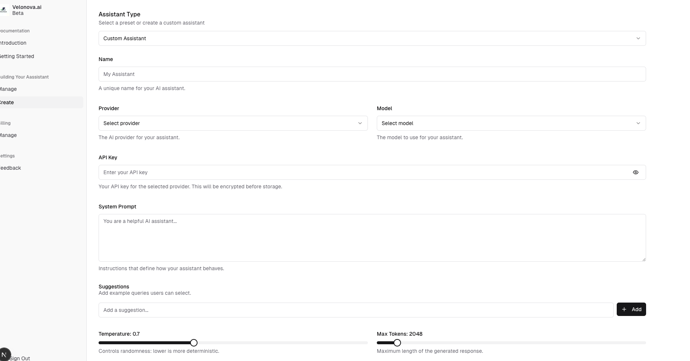
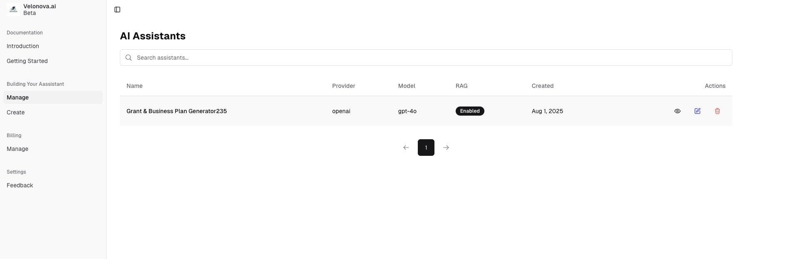
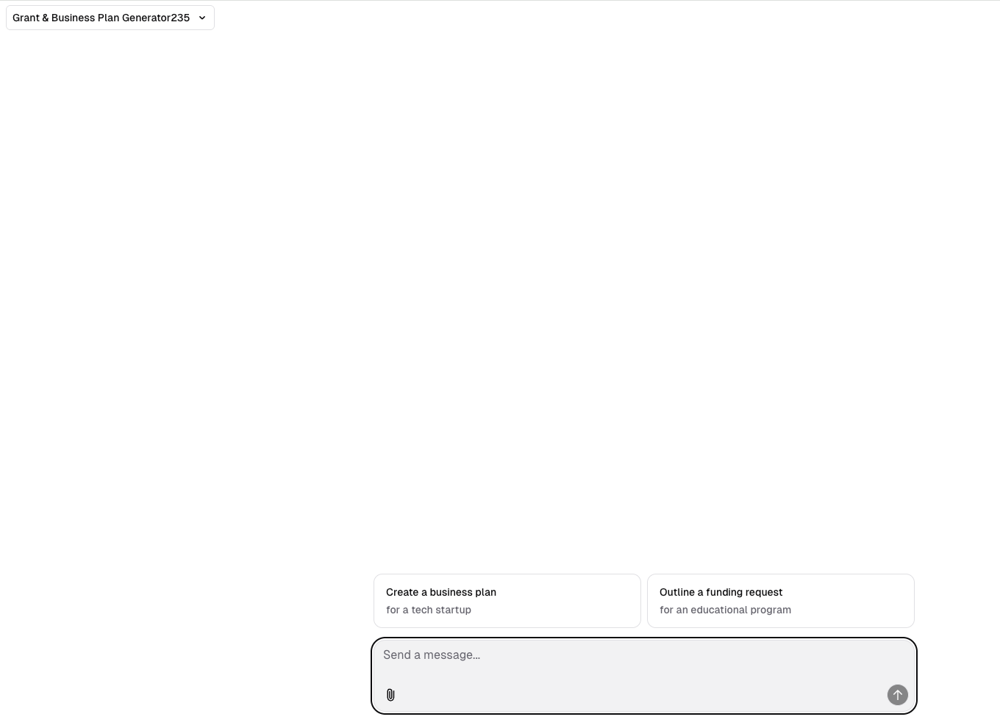

<a href="https://velonova.ai">
  
  <h1 align="center">LLMAdmin</h1>
</a>

<p align="center">
  An Open-Source LLM Admin Dashboard for creating and managing LLM's built With Next.js and the AI SDK by Vercel.
</p>

## Screenshots

<div align="center">
  
  
  
</div>

## Features

- Nextjs Auth
- Admin dashboard to create LLM's with temperature,max tokens, system prompts and RAG
- Deployable to Vercel with PostGres as the backend DB


## Deploy Your Own


## Running locally

You will need to use the environment variables [defined in `.env.example`](.env.example) to run Next.js AI Chatbot. It's recommended you use [Vercel Environment Variables](https://vercel.com/docs/projects/environment-variables) for this, but a `.env` file is all that is necessary.


```bash
pnpm install
pnpm dev
```

Your app template should now be running on [localhost:3000](http://localhost:3000/).

You modify the code to your needs as per the documentation on https://ai-sdk.dev/ and https://github.com/vercel/ai-chatbot
